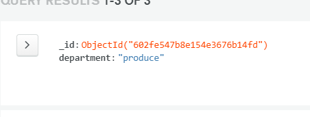

# MyShrink - A Site Designed To Easily Manage Shrink

A website built to help managers in Tesco bridge their skill gap with Shrink. Simplicity is the key
The website will be powered by a Mongodb that contains the inputed shrink from the managers.

## Ease of use

Really looking after your shrink can be challenging for many managers. This is due to a skill gap between being able to use Tesco SBO system and
being able to adequetly track it. The site will have registered members log in and enter the shrink manually. It will then be submitted to a Mongodb
that will be able to be edited, deleted, searched and added to. 

### Supported Departments

The site currently supports:
* GM
* FRESH FOOD
* PRODUCE

A Duty Manager will visted the app in the morning and log in. After this they will enter the top lines for the store into the database via the app
- 

After this the user will be redirected to the Home page where they can Edit if entered inncorrectly.
- 

Any Manager can log on to view their own shrink and from here they can also edit, delete and resolve shrink issues.
- 

A Manager can also visit the search function which will enable them to search for more shrink if they wish to see additional information.
- 

It can be used on all devices.

Hosted on [Heroku](https://my-shrink.herokuapp.com/)
Repository on [GitHub.com](https://github.com/leeton1412/myshrink)

## License
>This project is created for Tesco and is avaliable upon request [MyShrink](https://github.com/leeton1412/myshrink). 

## Database Design

### Which Database?

The choice I have made for the Database is [MongoDB](https://www.mongodb.com/3). The simple nature of it means that easy interaction is very much achievable which is the sites main aim.
Though was put into using MySQL but with MongoDB large amounts of information can be stored and easily manipulate. Simplicity is the key in bridging the skill gap.
Python3 will be used to call the functions. 

### Database structure

For this project I decided that i would use 3 Collections.

#### shrinkDB
 
This is the main database where information for all shrink is stored.

#### shrinkDb
 
This Database is mainly used to store the Departments to make sure a accurate department is selected making it easier to manipulate the database to what I need.
The Database name does need to be changed at a later date but due to time restrictions i was unable to obtain this

#### userDB

This Database will be used to store user credentials. With this I will be able to generate the correct information needed for the specific Team Manager

## UX

### Goals

The aim of this website is to provide a quick, easy to use, and intuative system so managers can quickly view their shrink

### Users

The predicted users of the site will be Managers, Area Directors, Colleagues and Depots.

### User Stories 
1. Managers looking to view their shrink to see what needs investigating.
2. Area Managers looking for a quick and accurate view of a stores shrink level.
3. Colleagues looking to take a bigger role within their store.
4. Depots looking for a more store driving view to help assist them with the performance management.
5. Managers looking to find out what theyve done for shrink before their performance reviews.

### Thoughts Behind The Design

The app is designed using Materialize to help comply to good UX design. The colors are chosen to match those of similar apps
avaliable to Tesco colleagues to try give a familiar feel to it, namley Inform.
- 

### Colors and theme of the website.

Materialize Easy to Use color scheme is used throughout to give a clean feel to the page.

* Blue Darken-1:   
* Light Blue:   
* Red Lighten -1: 

### Font Choices 
Header font throughout the website are chosen to obtain a clean look:

    *font-family: 'Rajdhani', sans-serif;

Elements such as paragraphs are a complementing font:

    *font-family: 'Noto Sans', sans-serif;

### WireFrames 

Here you can see screen shots of the Wire Frames. Due to time restrictions, there could of been more detail involved such as added images.

-    
     

## Features 

- Easy Navigation.
- Use of external Database to create easy interaction [MongoDB](https://www.mongodb.com/3)
- Hover affects on certain icons.
- GoogleMaps Javascript API to show store location.
- Shrink Add Section supporting 3 Departments.
- Auto Response email through Email.js
- Delete Shrink function only avalible to users logged in to ensure data remains safe.
- Edit Shrink function incase of miss entered information
- Links to other Tesco Apps that colleagues often find hard to find. 
- Float Button to help navigate the page to the most important sections easier.
- Alerts for users login and log out. Also for shrink being added and deleted.
- Login functionallity putting a user in session. 
- Registration functionallity registering the user to the database.
- Search Function to allow managers to search and delete all shrink. As this information is sensitive.
- Profile page displaying that users specific Shrink items.
- Live contact form using [Emailjs](https://www.emailjs.com).
- Collapsible Nav bar using Materialize.
- Collapisble cards from Materialize containing information on how to use the site and what shrink is.
- Responsive Mobile first design.
- [Materialize](https://materializecss.com/getting-started.html) 
    - CSS class utilites
    - Grid system
    - Layout Change
    - Input form

### Features Still to Include 

Due to limitations with current personal circumstances and Covid-19, the time I spent on this project did not give me the required time to implement every thing at launch. 

- More Department support
    - Currently the site only supports 3 departments. Ideally this would cover the whole of the store 
- More Search Functionality.
    - Original design did not include this, but it has become clear on testing that more search options would make a better user experience. 
- Multi-Store Support
    - Currently only one store is supported at launch. Ive multiple stores used the app information would be hard to read and understand 
    - Another Key Field could be added to help redefine the what information is displayed
    - Create a way to fill player names in randomly to ensure brackets are fair and random 
- Shrink Next-Step Form
    - Feedback I have been given is that a shrink next step form could be very beneficial as we could track what managers are doing following meetings.

### Technologies Used:

Technologies used in the making of this page are:

- [Font-Awesome](https://fontawesome.com/)
    - Used for icons across the project
- [HTML](https://www.w3schools.com/whatis/whatis_html.asp)
    - Used to structure the site. 
- [CSS](https://www.w3schools.com/whatis/whatis_css.asp)
    - Used to style the website. 
- [Javascript](https://www.w3schools.com/js/DEFAULT.asp)
    - Used for GoogleMaps, Float Button, and live contact form on contact.html. 
- [Jquery](https://jquery.com/download/)
    - Used to initialize a varity of functions from Materialize 
- [Flask](https://flask.palletsprojects.com/en/1.1.x/)
    - Is used for back end application and interaction with front end
- [Pymongo](https://pymongo.readthedocs.io/en/stable/)
    - Used to interact between python and MongoDB
- [Werkzeug](https://werkzeug.palletsprojects.com/en/1.0.x/)
    - Used to create the registration page and salt the users password for protection
- [Google Chrome](https://www.google.com/chrome/)
    - Used to inspect the website via dev tools.
- [Google](http://www.google.com)
    - Used to conduct searches
- [Python3]
    - Used to for most functionallity on the site for example, calling the database. 
- [Emailjs](https://www.emailjs.com/docs/)
    - Used to create a live contact form.
- [Materialize](https://materializecss.com/getting-started.html)
    - Used to create a great UX design that is mobile responsive.
- [GoogleMaps Api](https://developers.google.com/maps/documentation/javascript/get-api-key)
    - Used to create a Map image in the footer showing the location of the store.
- [CDN.js](https://cdnjs.com/)
    - Used to import different plugins.
- [Gitpod](https://www.gitpod.io/)
    - Used to build the website.
- [GitHub](https://github.com/)
    - Used for Repository.
- [Gitpages](https://pages.github.com/)
    - Used to Host the website. 
- [Am I Responsive?](http://ami.responsivedesign.is/)
    - Used to check the responsive design of the website.
- [Jinja](https://jinja.palletsprojects.com/en/2.11.x/)
    - Used to loop through information from the database and display it accurately.
- [Heroku](https://en.wikipedia.org/wiki/Heroku)
    - Used to deploy the App
- [BeFunky](https://www.befunky.com/)
    - Used to resize images
### Personal Testing

## Functionality

All interactions with the database are working as intended. Some issues with layout have however been discovered.

    
This Screen shows a user successfully logging out

This shows a user loggin in

 
This shows a user registering successfully

This screen shows a user using the search function. Search will not accept partial inputs. Results dont display clean on smaller devices

This shows a user Adding Shrink. It did not accept spaces in product name. This has been fixed

This shows a user using the contact form. Contact Works as intended.

This shows a user using the edit function . Works as intended.

This shows a user using the delete function only provided on profile or search. Works as intended.

## Problems encountered

During Testing some problems have been discovered.
- On mobile screens, the information can overload the cards and force
  the information to stack incorrectly. This issue is currently being looked into. Also, products must be searched for by
  full name as partial search is not working. 
  
- Flash Images get stuck under Nav bar due to javascript function. Currently looking into a fix. 
- Google Map not showing.
    - This is due to billing account not being linked which I am currently not comfortable doing. 

## User Testing

The site was tested by users and software. It has been tested on Google Chrome v83.0.4103.97 and Mozilla Firefox v77.0.1 (64) on Acer Ryzen 5 and also 
a desktop PC. It has also been tested on Ipad Pro, Samsung Galaxy s9, Iphone 11 pro.

### Jack Bailey

Jack was asked to test the app and to feed back on any problems that he encountered or for any feed back he might have. Test was carried out on iphone 10 & a Acer Laptop
- Problems Encountered 
    - Shrink doesnt display in a inline manner.
        - Issue was due to materialize buttons. A fix is being worked on.
    - Titles not clear.
        - Headings of the website where not clear. A opacity has been added.
    - Back-ground of menu items on toggle makes it hard to read
        - This is a valid point and is being changed

- Feed Back. 
    - Syntax Error with text on Home Page
        - Syntax wording did not match with flow of page.
        - The text has now been corrected. 

### Sam Jones

Sam was asked to test the page and to feed back on any problems that he encountered or for any feed back he might have. 
- Problems Encountered.
    - No issue in the use of the app.
- Feed Back
    - Potential for a shrink next step page to log meetings.
        - This is very vaild and is being looked into. 

### Ian Westwood

Ian was asked to give feedback on the layout of the App.
- Feed Back.
    - Home text would not fit on screens 650 and below.
        - Media Query has been added to change this.
    - Potential for a KPI section.
        - This would be very useful for the company and will be looked into.
    - Create an Alert for contact page to know it has been sent.
        - This has now been implemented.
    - Spelling across the pages is incorrect.
        - This is being looked into and a full spellcheck is being carried out.

## Technologies used for testing.

### [W3c Markup Validation](https://validator.w3.org/)

Used to look for any potential problems.
- Problems.
    - line 130 parse error, 177 parse error in CSS. Unsure as to what is causing the error and is being looked into.
    - Double occurance of id. This is due to a jinja loop. 
    
### Deployment

The App is deployed on [GitHub Pages](https://leeton1412.github.io/myshrink/)

The process:
- Host a git repository on Github.
- In the settings for the repository scroll down till Github Pages section.
- Select which Branch you would like in source section. (Normally Master Branch)
- Change the address of your website if required 
- Save changes. 
- The page is now ready to be viewed.
- The generic page set up will be 'yourusername'.github.io/'thereponame'

It is then Deployed using [Heroku](https://my-shrink.herokuapp.com/)
The process:
- First we tell Heroku what dependancies are needed using the gitpod terminal and the command *pip3 freeze local > requirements.txt*
- Then we tell Heroku which file runs the app using the command *echo web: python app.py > Procfile*
- Then go to Herko.com, log in and click create a new App. We Name our app then select Region closest to you and click create app
- Then we click on the GitHub delpoyment method on the deployment Tab
- Search for the GitHub Repo we want then click connect
- We then go to the reveal config vars option via the settings tab as we have hidden our env.py. From here we input the values that are required
- Then we push our new files in Gitpod to the Repo.
- Then back on Heroku we click enable automatic deployment.
- Then we chose what branches to delpoy and click deploy.
- Heroku will then build the required packages and deploy the App.

## Credits

### Content 

- All images from this website are obtained from [Unsplash](https://unsplash.com/)
 
- Nav bar basic structure obtained from [Materialize](https://materializecss.com/getting-started.html).

- Footer basic structure obatined from [Materialize](https://materializecss.com/getting-started.html).

### Acknowledgments 

- Thanks to Seun Owonikoko @seun_mentor.
- Stuart Crang for encouraging me to join the course.
- Code Institute Support team for their fantastic support through a difficult time in my life
- My current Linkedin Group for continued help and motivation. 
- Code institute tutor support for always being available and willingness to support.  
- Code institute for providing me with the tools to chase my dreams. 

    

